# 2020q3 Homework1 (quiz1)

contributed by < `blueskyson` >

###### tags: `linux2020`

## 目錄

[TOC]

## 延伸問題 1

### node_t

```cpp=
typedef struct __node {
    int value;
    struct __node *next;
} node_t;
```

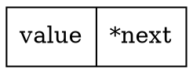

### void add_entry(node_t **head, int new_value)

```cpp=
void add_entry(node_t **head, int new_value)
{
    node_t **indirect = head;

    node_t *new_node = malloc(sizeof(node_t));
    new_node->value = new_value;
    new_node->next = NULL;

    assert(new_node)
    while (*indirect)
        indirect = &(*indirect)->next;
    *indirect = new_node
}
```
#1 宣告新的節點 new_node 指向 NULL，indirect 指向 head
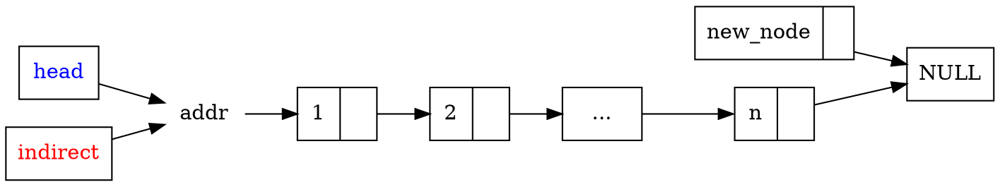
#2 將 indirect 指向第 2 個節點的位址的位址
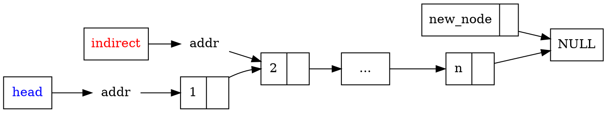

#n+1 將 indirect 指向第 n 個節點的的位址的位址

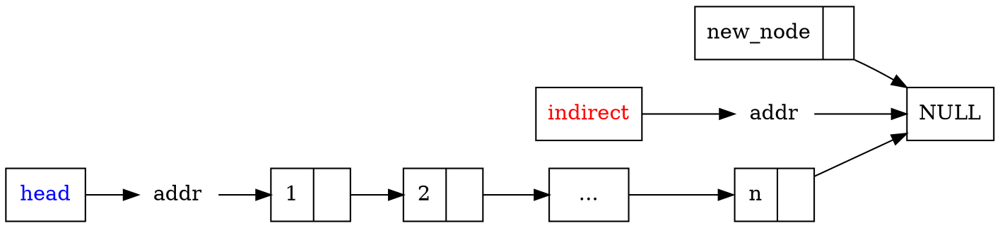

#n+2 讓 indirect 取值，並令其指向 new_node 的位址

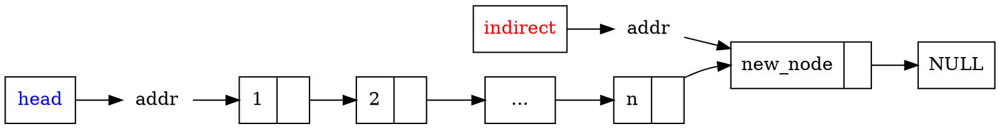

### node_t *find_entry(node_t *head, int value)

```cpp=
node_t *find_entry(node_t *head, int value)
{
    node_t *current = head;
    for (; current && current->value != value; current = current->next)
        /* interate */;
    return current;
}
```

#1 宣告 current 指向 head 所指的節點
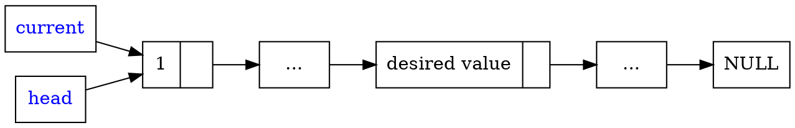
#2 比對每個節點的 value 是否為所求，若是就停止搜尋
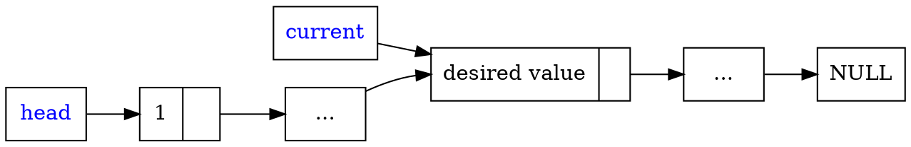

### void remove_entry(node_t **head, node_t *entry)

```cpp=
void remove_entry(node_t **head, node_t *entry)
{
    node_t **indirect = head;

    while ((*indirect) != entry)
        indirect = &(*indirect)->next;

    *indirect = entry->next;
    free(entry);
}
```
#1 indirect 指向 head 的位址
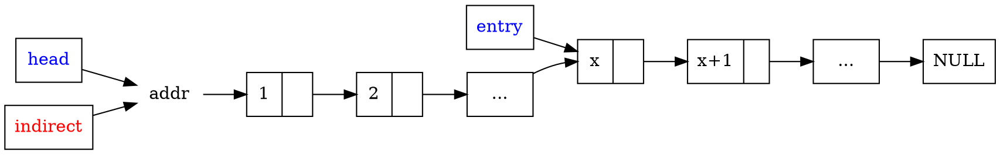

#2 indirect 指第二個節點的位址的位址
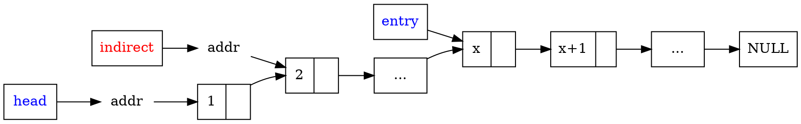

#x indirect 指第 x 個節點的位址的位址
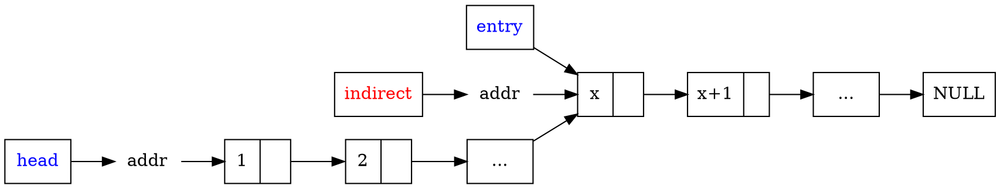

#x+1 把 addr 的值換成第 x+1 節點的位址，之後將第 x 節點釋放
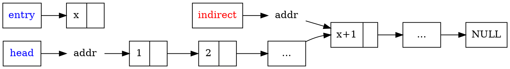

### node_t *swap_pair(node_t *head)

```cpp=
node_t *swap_pair(node_t *head)
{
    for (node_t **node = &head; *node && (*node)->next;
    node = &(*node)->next->next) {
        node_t *tmp = *node;
        *node = (*node)->next;
        tmp->next = (*node)->next;
        (*node)->next = tmp;
    }
    return head;
}
```
#1 讓 tmp 指向 node 取值
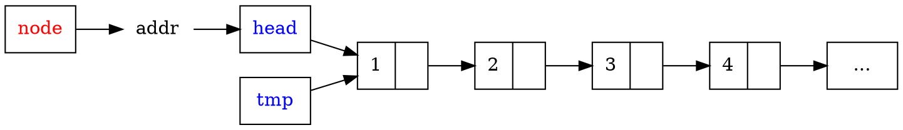

#2 修改 node 取值
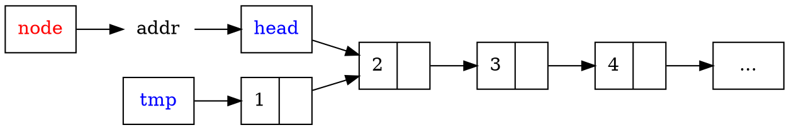

#3 修改第一個節點的 next
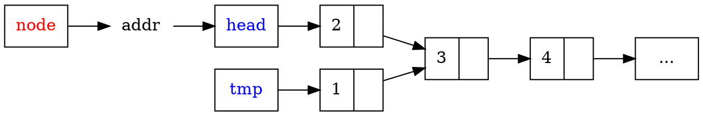

#4 修改第二個節點的 next
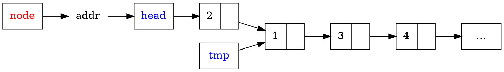

#5 將 node 指向下個節點位址的位址，然後重複執行交換的動作

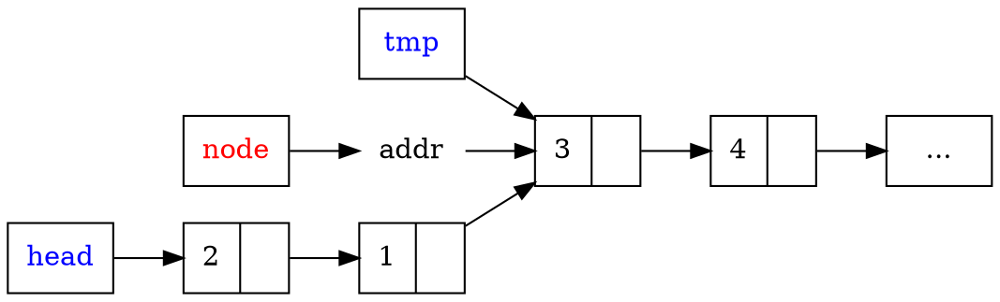

### node_t *reverse(node_t *head)

```cpp=
node_t *reverse(node_t *head)
{
    node_t *cursor = NULL;
    while (head) {
        node_t *next = head->next;
        head->next = cursor;
        cursor = head;
        head = next;
    }
    return cursor;
}
```

#1 cursor = NULL, next = head->next
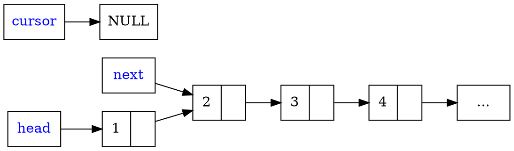

#2 head->next = cursor
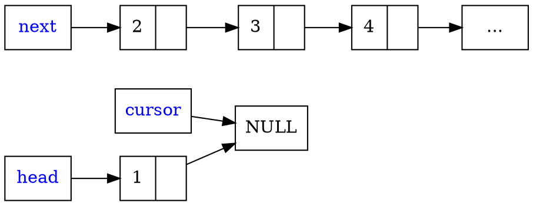

#3 cursor = head
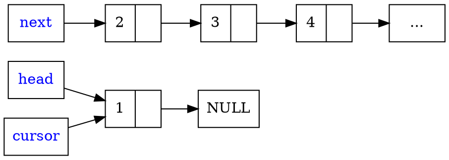

#4 head = next
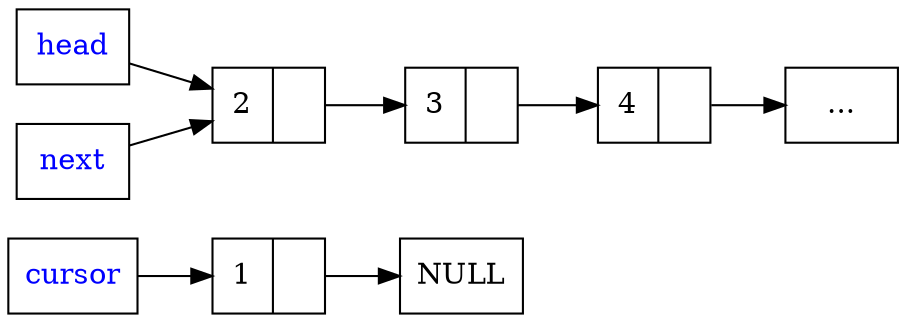

#5 next = head->next ，然後持續做直到 head 指向 NULL
```graphviz
digraph g2 {
    rankdir=LR;
    node [shape=record]
    1 [label = "{<val>1 |<ptr>}"]
    2 [label = "{<val>2 |<ptr>}"]
    3 [label = "{<val>3 |<ptr>}"]
    4 [label = "{<val>4 |<ptr>}"]
    5 [label = "{<val>...}"]
    
    head[fontcolor=blue]
    next[fontcolor=blue]
    cursor[fontcolor=blue]
    
    head->2->3->4->5
    next->3
    cursor->1->NULL
}
```

## 延伸問題 2

將 `swap_pair` 改寫為不用回傳指標，調用時，呼叫 `swap_pair(&head)`

```cpp=
void swap_pair(node_t **head) {
    for (node_t **node = head; *node && (*node)->next;
        node = &(*node)->next->next) {
        node_t *tmp = *node;
        *node = (*node)->next;
        tmp->next = (*node)->next;
        (*node)->next = tmp;
    }
}
```

將 reverse 改寫為不用回傳指標，調用時，呼叫 reverse(&head)

```cpp=
void reverse(node_t **head)
{
    node_t *cursor = NULL;
    while (*head) {
        node_t *next = (*head)->next;
        (*head)->next = cursor;
        cursor = *head;
        *head = next;
    }
    *head = cursor;
}
```

## 延伸問題 3

以遞迴改寫 reverse ，調用時，呼叫 reverse(&head)

```cpp=
void recur_rev(node_t **head, node_t *cursor) {
    if (*head == NULL) {
        *head = cursor;
        return;
    }
    node_t *next = (*head)->next;
    (*head)->next = cursor;
    cursor = *head;
    *head = next;
    recur_rev(head, cursor);
}

void reverse(node_t **head) {
    if (!head)
        return;
    recur_rev(head, NULL);
}
```

## 延伸問題 4

針對 singly-linked list 的節點，實作 Fisher–Yates shuffle ，我參考 [Pencil-and-paper method](https://en.wikipedia.org/wiki/Fisher%E2%80%93Yates_shuffle#Pencil-and-paper_method) 實作

- 首先確認 linked list 的節點多於 1 個，若否就直接退出

- 初始化亂數表，宣告 `int max` 記錄節點的數量、 `node_t *tail` 指向最後一個節點，這兩個變數在第 9 行的迴圈完成初始化

- 接下來執行迴圈 `max` 次，每次會從第 0 到 max - 1 個之中隨機挑選一個數字 `picknum`，然後第 `picknum` 個節點會被移到 `tail` 節點後面並且成為新的 `tail` ，迴圈結束時即完成 shuffle
```cpp=
void fisher_yates_shuffle(node_t **head)
{
    if (!head || !(*head) || !(*head)->next)
        return;

    srand(time(NULL));
    int i, max = 1;
    node_t *tail;
    for (tail = *head; tail->next; tail = tail->next)
        max++;
    
    for (i = max; i > 0; --i) {
        int j, picknum = rand() % i;
        if (picknum == 0) {
            tail->next = *head;
            *head = (*head)->next;
            tail = tail->next;
            tail->next = NULL;
            continue;
        }

        node_t *prev;
        for (j = 0, prev = *head; j < picknum - 1; j++)
            prev = prev->next;
        tail->next = prev->next;
        prev->next = prev->next->next;
        tail = tail->next;
        tail->next = NULL;
    }
}
```